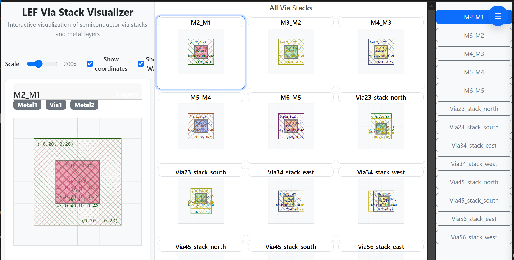
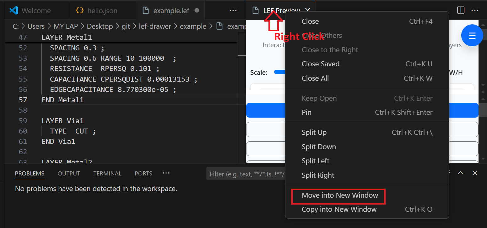

# LEF Visualizer

A VS Code extension for visualizing LEF (Library Exchange Format) files with interactive web-based previews.



## Features

- **LEF File Preview**: Open and visualize LEF files with an interactive web-based preview
- **Real-time Updates**: Preview updates automatically as you edit the LEF file
- **Interactive Visualization**: View via stacks and metal layers with dynamic styling
- **Web Extension**: Works in VS Code for the Web and desktop

## Commands

- `LEF : Show Preview` - Opens a webview with the LEF file visualization
- `Hello World` - Basic test command

## Requirements

- VS Code 1.82.1 or higher
- LEF files to visualize

## Usage

1. Open a LEF file in VS Code
2. Run the commands `Ctrl + Shift + V` and start editing your LEF file
3. For easier visaulization move the preview to different window
    
2. Run the command `LEF : Show Preview` from the command palette (Ctrl+Shift+P)
3. The extension will parse the LEF file and display an interactive visualization in a webview

## Example LEF
```
VIA M2_M1 DEFAULT
  LAYER Metal1 ;
    RECT -0.200 -0.200 0.200 0.200 ;
  LAYER Via1 ;
    RECT -0.100 -0.100 0.100 0.100 ;
  LAYER Metal2 ;
    RECT -0.200 -0.200 0.200 0.200 ;
  RESISTANCE 6.400000e+00 ;
END M2_M1

VIA M3_M2 DEFAULT
  LAYER Metal2 ;
    RECT -0.200 -0.200 0.200 0.200 ;
  LAYER Via2 ;
    RECT -0.100 -0.100 0.100 0.100 ;
  LAYER Metal3 ;
    RECT -0.200 -0.200 0.200 0.200 ;
  RESISTANCE 6.400000e+00 ;
END M3_M2
```
## Extension Settings

This extension does not currently add any VS Code settings.

## Known Issues

- Currently supports basic LEF file parsing and visualization
- Webview communication may require the webview to be fully loaded before data is sent

## Release Notes

### 0.0.1

- Initial release of LEF Visualizer
- Basic LEF file parsing and visualization
- Web-based preview with React components
- Real-time editor updates

---

## Development

This extension is built using:
- TypeScript
- React (for webview components)
- Webpack for bundling
- VS Code Extension API

## Future Enhacements
- Make the preview tab name same as file name which data got extracted

## For more information

* [Visual Studio Code's Extension API](https://code.visualstudio.com/api)
* [LEF File Format](https://en.wikipedia.org/wiki/Library_Exchange_Format)
## To contribute or rasie issues
* Raise a GIT issue here ---> [LEF Visualizer](https://github.com/pkalyankumar1010/lef-drawer/issues)

**Enjoy visualizing your LEF files!**
